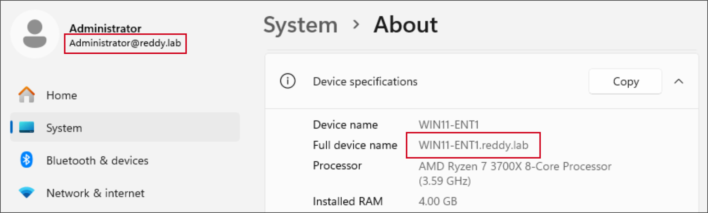

# Proxmox Homelab - Enterprise Security Lab 


## Table of Contents
1. [Overview / Purpose](#overview--purpose)
2. [Key Skills Demonstrated](#key-skills-demonstrated)
3. [Lab Environment](#lab-environment)
     - [VM List](#vm-list)
4. [Project Setup and Configuration](#project-setup-and-configuration)
5. [Testing and Results](#testing-and-results)
6. [Conclusion](#conclusion)
7. [Future Scope](#future-scope)


## Overview / Purpose
This project is a fully virtualized enterprise security lab built on proxmox to replicate a real-world corporate environment. It combines **system administration, network security, adversarial testing, and SIEM implementation** to simulate both attacker and defender perspectives.

The goal of this lab was to design, deploy, and secure a small enterprise network while gaining hands-on experience with Active Directory administration, firewall and IPS/IDS configuration, adversarial attack simulation, and centralized log monitoring with a SIEM.


## Key Skills Demonstrated
1. **Virtualization and Networking**
   - Proxmox VM provisioning.
   - Snapshot management.
   - Network segmentation (WAN/LAN interface seperation).
   - NAT and firewall rules.
2. **Firewall and Intrusion Prevention System / Intrusion Detection System**
   - pfSense firewall configuration.
   - Suricata IPS/IDS (inline block and alert modes).
   - Rule tuning.
3. **Enterprise Windows Administration**
   - Windows Server 2022 Active Directory Domain Services (domain - `reddy.lab`).
   - Organizational Units (OUs) and Group Policy Objects (GPOs) for `LabUsers`, `Workstations`, and domain-wide security policies.
   - Windows 11 domain join and policy enforcement testing.
4. **Adversarial Simulation (Red Team Testing)**
   - Kali Linux attacks (Nmap scans, Hydra brute force, SMB enumeration, ICMP floods).
   - Validation of attacker activity in pfSense firewall logs, Suricata eve.json, Windows Event Viewer, and SIEM dashboard.
5. **Security Information and Event Management (SIEM)**
   - Wazuh deployment on Ubuntu Server.
   - Windows agents installation and enrollment.
   - Centralized log collection and monitoring.
   - Detection and investigation of security events (failed logons, brute force, account lockouts).
6. **General Security Operations**
   - Log analysis across firewall, IPS/IDS, endpoint, and domain controller.
   - Detection-to-response workflow simulation (attack -> detection -> investigation).
   - Practical SOC analyst skills including correlation and incident documentation.

## Lab Environment
This homelab is built on a **Proxmox VE 8.4.11** hypervisor running on a host with:
1. **Host Hardware:** 16 vCPUs, 32 GB RAM.
2. **Networking:**
   - pfSense provides WAN and LAN segmentation.
   - WAN interface connected to external network (internet).
   - LAN interface hosts internal lab environment (AD, endpoints, and SIEM).
3. **Virtual Machines:** 5 VMs (see [VM List](#vm-list))
4. **Security Stack:**
   - pfSense with Suricata IPS/IDS
   - Wazuh SIEM on Ubuntu Server for centralized log collection, monitoring and dashboards.

### VM List
| VM Name          | OS / Role                          | RAM | vCPUs | Purpose                                                                 |
|------------------|-------------------------------------|-----|-------|-------------------------------------------------------------------------|
| pfSense          | FreeBSD / Firewall & Router         | 4GB | 2     | WAN/LAN segmentation, firewall rules, Suricata IPS/IDS                  |
| AD-Server2022    | Windows Server 2022 / Domain Controller | 6GB | 2 | Domain Controller, Active Directory, Group Policy management            |
| Win11-ENT1       | Windows 11 Enterprise Workstation   | 6GB | 2     | Domain-joined endpoint for user/GPO testing, Windows event logging      |
| Kali-Linux       | Debian / Penetration Testing        | 4GB | 2     | Attack simulations (nmap, hydra, SMB enumeration, ICMP flood)           |
| Wazuh-SIEM       | Ubuntu Server 22.04 / SIEM          | 4GB | 2     | Centralized log aggregation, alerting, dashboards via Wazuh & ELK stack |


## Project Setup and Configuration
### Proxmox Host
1. **Version:** Proxmox VE 8.4.11
2. **Resources:** 16 vCPUs, 32 GB RAM, 1 TB SSD storage.
3. **VM Allocation:** 5 VMs with dedicated CPU, RAM, and thin provisioned storage for realistic enterprise simulation.
4. **Networking:**
   - `vmbr0` (WAN bridge) - connected to physical uplink for internet access.
   - `vmbr1` (LAN bridge) - isolated internal network for domain, endpoints, attacker, and SIEM.
5. **Management:** Proxmox web UI accessible at `https://<management_interface_IP>:8006`. Host configured with lab-only FQDN `pve.lab` (appears as node `pve` in the UI).


<br>
<p align="center">
  <br>
  <em>Proxmox VM Inventory</em>
</p>
<br>
<p align="center">
  <br>
  <em>Proxmox Network Interface and Bridges</em>
</p>
<br>


### pfSense Firewall and Suricata IPS/IDS
1. **pfSense Configuration:**
   - **Management** - pfSense web UI accessible at `https://<LAN_interface_IP>` for configuration and monitoring.
   - **WAN Interface** -  configured with static / private IP for controlled internet acces. IPv6 disabled.
   - **LAN Interface** - configured with static IP to serve the internal lab network for AD, endpoints, and SIEM.
   - **Firewall Rules Setup:**
     - **WAN Rules**
       - Block private networks {RFC1918) from WAN.
       - Block bogon networks.
     - **LAN rules**
       - Anti-Lockout Rule - ensures admin access to pfSense is never blocked.
       - Default Allow LAN to Any - permits lab VM communications within LAN and outbound traffic.
   - **NAT configuration**:
     - **Port forwarding** - RDP (TCP 3389) forwarded to AD-Server2022 and win11-ENT1 to test external attack scenarios.
     - **Temporary testing** - NAT reflection and Outbound NAT enabled for internal testing and reverted afterward.


<br>
<p align="center">
  <br>
  <em>pfSense Web UI Dashboard showing WAN and LAN interfaces.</em>
</p>
<br>


2. **Suricata Setup:**
   - **Mode Configuration:**
     - **WAN Interface** - Inline mode with block offenders enabled to actively drop malicious traffic.
     - **LAN Interface** - Alert-only mode for monitoring internal network traffic without blocking.
   - **Rule Categories Enabled:**
     - ET SCAN
     - ET ATTACK_RESPONSE
     - ET EXPLOIT
     - ET MALWARE
     - ET SHELLCODE
     - ET DOS
     - ET BOTCC
     - ET WORM
   - **Rule Action Customization:**
     - Modified selected ET rules to `drop`, ensuring traffic that matched these signatures was both alerted and blocked.
     - **Custom Rules:**
       - Local RDP Brute Force Attempt rule - created to detect and block unauthorized RDP login attempts.
       - Local ICMP Flood Detection rule - created for ICMP flood testing. However, detections were ultimately handled by the existing GPL SCAN Nmap Ping rule in the ET SCAN category, demonstrating Suricata’s rule precedence.
     - **Logging** - enabled Eve JSON Logging to capture all alerts and drops in `eve.json`. Logs were accessible through both the pfSense web UI and console for review.


<br>
<p align="center">
  <br>
  <em>Suricata IPS/IDS interface showing WAN in inline block mode and LAN in default alert-only mode.</em>
</p>
<br>
<p align="center">
  <br>
  <em>Custom Suricata rules for detecting RDP brute force attempts and ICMP floods.</em>
</p>
<br>
<p align="center">
  <br>
  <em>Eve JSON logging output from Suricata.</em>
</p>
<br>


### Windows Server 2022
1. **Server Role:**
   - Installed Active Directory Domain Services (AD DS) role on Windows Server 2022 (AD-Server2022)
   - Promoted server to Domain Controller and created a new forest `reddy.lab`.
2. **Networking:** Configured static IPv4 LAN IP for consistent domain communication.
3. **Domain Configuration:**
   - Established root domain `reddy.lab`.
   - Created Organizational Units (OUs) `LabUsers` and `Workstations` for logical structure.
4. **Group Policy Objectives:**
   - Implemented baseline hardening and user environment controls, including:
     - **Authentication & Security** – password complexity, account lockout policies.
     - **Advanced Audit Policy Configuration** - logon events, object access, policy changes, privilege use, etc.
     - **Access Restrictions** – disabled Control Panel, Task Manager, Registry Editor, Command Prompt, removable storage, and Windows Settings.
     - **User Environment** – enforced shared drive mapping, file sharing / folder redirection for centralized access, logon banner, and applied corporate wallpaper.
     - **System Updates** – configured Windows Update to manual (notify).
   - 📄 [Full GPO Report (HTML)](docs/gpo-report.html)


<br>
<p align="center">
  <br>
  <em>Active Directory Users and Computer, Organizational Units (LabUsers and Workstations) created.</em>
</p>
<br>
<p align="center">
  <br>
  <em>Group Policy Objects linked to LabUsers in reddy.lab domain.</em>
</p>
<br>
<p align="center">
  <br>
  <em>Mapped network drive on Windows 11 endpoint showing GPO-enforced drive mapping and access to centralized folder.</em>
</p>
<br>
<p align="center">
  <br>
  <em>Windows Server 2022 showing redirected Documents folder for user pavan, synchronized via Group Policy folder redirection.</em>
</p>
<br>


### Windows 11 Enterprise (Endpoint)
1. **Networking:** Configured with static IPv4 LAN IP for stable connectivity within the lab network.
2. **Domain Membership:**
   - Joined to the Active Directory domain `reddy.lab`.
   - User account from the `LabUsers` OU was used to log in and validate domain authentication.
3. **Testing Role:**
   - Served as a controlled endpoint for validating GPO enforcement.
   - Used as a target system for attack simulations from Kali Linux (RDP brute force, SMB enumeration, ICMP flood) to validate firewall and IDS/IPS effectiveness.


<br>
<p align="center">
   About page showing Windows 11 Enterprise edition and domain membership." width="800"/><br>
  <em>Windows 11 Enterprise endpoint joined to the reddy.lab Active Directory domain.</em>
</p>
<br>
<p align="center">
  <br>
  <em>Domain-level workstation policy applying logon banner to Windows 11 endpoint.</em>
</p>
<br>


### Kali Linux (Attacker VM)
1. **Networking:**
   - Configured with dual network interfaces for targeted attack scenarios:
     - **WAN Interface** - Static IP used for external attack simulations against the lab’s WAN Interface.
     - **LAN Interface** - Static IP used for internal attack simulations within the lab network.
   - Ensured correct interface usage by explicitly binding tools to interfaces (e.g., `-e eth1`) wherever applicable. 
2. **Attack Toolset:**
   - **Nmap** – for network discovery and port scanning (SYN, TCP, and UDP).
   - **Hydra** – for brute force password attacks against RDP.
   - **SMBClient / Enum4linux** – for SMB enumeration, SMB authentication test, and probing domain-related information.
   - **Hping3** – for simulating ICMP flood traffic.
3. **Testing Role:**
   - Served as the controlled attacker system for simulating both WAN-side and LAN-side adversarial activities.
   - Attack traffic was later validated through pfSense firewall logs, Suricata `eve.json` logs, and Wazuh SIEM.


### Wazuh SIEM (Ubuntu Server)
1. **Server Setup:**  
   - Deployed Wazuh SIEM on Ubuntu Server using the official installation script:  
     ```bash
     curl -sO https://packages.wazuh.com/4.12/wazuh-install.sh && sudo bash ./wazuh-install.sh -a -i
     ```  
   - Configured with a static LAN IP for consistent accessibility.  
   - Web UI dashboard accessible via `https://<Ubuntu_Server_LAN_IP>:443`.
2. **SIEM Configuration:**  
   - Wazuh Manager installed as part of the deployment stack.  
   - Centralized management of agent registration and monitoring through the Wazuh console. 
3. **Agent Deployment:**  
   - Wazuh Agents installed on Windows Server 2022 (AD-Server2022) and Windows 11 Enterprise (Win11-ENT1).  
   - Extracted authentication keys from the wazuh manager and applied to each endpoint for secure enrollment and registration.
4. **Log Forwarding & Visibility:**  
   - Forwarded Windows Event Logs from both endpoints into Wazuh SIEM.  
   - Security events validated and analyzed through the Threat Hunting module in the web UI.
   - *(Note: pfSense/Suricata logs were not integrated in this deployment.)*


## Testing and Results
1. **GPO Validation:**
   - **Purpose:** Confirm that domain policies were correctly applied to users and endpoints.
   - **Tests Performed:**
     - **Authentication & Security** - logon/logoff auditing, account lockout enforcement after failed login attempts.
     - **Access Restrictions** - checked that Control Panel, Task Manager, Registry Editor, CMD, and Windows Settings were blocked for `LabUsers` as per policy.
     - **User Environment Policies:**
       - Validated wallpaper enforcement.
       - Confirmed file sharing and folder redirection - user Documents folder was redirected to the domain controller (`C:\Shares\Redirected\<username>\Documents\`), and changes were synchronized.
       - Verified shared drive mappings were accessible and consistent with policy.
     - **System Updates** - Confirmed Windows Update configuration enforced (manual/notify).
   - **Key Evidence:**
     - Screenshot of Windows 11 endpoint showing applied wallpaper and restricted access to Task Manager.
     - Screenshot of account lockout event in Wazuh SIEM.
     - Screenshot of redirected Documents folder on the Windows Server 2022 showing user-specific files.
     - Screenshot of mapped network drive confirming GPO enforcement.
2. **WAN Adversarial Simulation:**
   - **Purpose:** Validate the perimeter security configuration, including pfSense firewall and Suricata IPS (inline, block offenders mode on WAN).
   - **Tests Performed:**
     - **Network Scanning** - Nmap scans from Kali WAN interface to identify open ports and services. Three types of scans performed include:
       - **SYN Scan**
         ```bash
         nmap -e eth0 -sS -Pn <WAN_IP>
         ```
       - **TCP Scan**
         ```bash
         nmap -e eth0 -sT -Pn <WAN_IP>
         ```
       - **UDP Scan**
         ```bash
         nmap -e eth0 -sU -Pn <WAN_IP>
         ```
     - **Brute Force Attack** - Hydra used for RDP password brute force attempts targeting Win11-ENT1 via WAN.
       ```bash
       hydra -l <username>@reddy.lab -P /usr/share/wordlists/rockyou.txt rdp://<WAN_IP> -t 2
       ```
     - **ICMP Flood** - Simulated ping flood of 50 packets with a difference of 1ms between each packet using hping3 via WAN.
       ```bash
       hping3 -1 -c 50 -i u1000 <WAN_IP>
       ```
     - **Service Enumeration** – `enum4linux` used to attempt SMB enumeration against exposed services.
       ```bash
       enum4linux -a <WAN_IP>
       ```
   - **Expected Behavior:**
     - Suricata IPS should detect and block malicious traffic according to signatures.
     - pfSense firewall should log and drop inbound traffic matching attack attempts.
   - **Key Evidence:**
     - Screenshot of Suricata eve.json showing “GPL SCAN Nmap ping” rule triggered.
     - Screenshot of Wazuh Threat Hunting dashboard showing detected RDP brute force attempts.
     - Screenshot of pfSense firewall logs showing baseline blocking rules (e.g., Block Private Networks) and note that attack-specific logs were captured primarily via Suricata IPS.
3. **LAN Adversarial Simulation:**
   - **Purpose:** Validate internal security visibility and monitoring by simulating adversarial activity originating within the LAN. Due to the flat LAN topology (all endpoints on the same subnet), Suricata on pfSense could not observe intra-LAN traffic directly. Therefore, testing focused on endpoint log visibility, authentication events, and brute-force detection.
   - **Tests Performed:**
     - **Brute Force Attacks** - Hydra used for RDP password brute force attempts targeting Win11-ENT1 via LAN.
       ```bash
       hydra -l <username>@reddy.lab -P /usr/share/wordlists/rockyou.txt rdp://<LAN_IP> -t 2
       ```
     - **SMB Authentication Test** - Attempted SMB enumeration using `smbclient` with incorrect credentials to generate failed login events.
       ```bash
       smbclient -L //<LAN_IP> -U <username>@reddy.lab
       ```
     - **ICMP Flood** - Simulated ping flood of 50 packets with a difference of 1ms between each packet using hping3 via LAN.
       ```bash
       hping3 -1 -c 50 -i u1000 <LAN_IP>
       ```
   - **Expected Behavior:**
     - Windows Event Logs should capture authentication failures and account lockouts..
     - Wazuh SIEM should aggregate endpoint logs and highlight failed login attempts and policy enforcement events.
   - **Key Evidence:**
     - Screenshot of failed login attempts in Wazuh SIEM showing source IP from Kali LAN interface.
     - Screenshot of domain user account lockout events in Wazuh SIEM.
4. **Summary of Findings:**
   - **GPO Enforcement:** Group Policies were applied successfully across endpoints. Authentication auditing, account lockout thresholds, access restrictions, and user environment controls (wallpaper, shared drive mappings, and folder redirection) functioned as intended, ensuring centralized configuration management and policy enforcement.
   - **WAN Security:** External adversarial activity—including Nmap scans, RDP brute force attempts, service enumeration, and ICMP floods—was detected and blocked by Suricata IPS in inline mode. pfSense firewall enforced baseline WAN restrictions, while Wazuh SIEM provided visibility of intrusion attempts.
   - **LAN Security:** Due to the flat LAN topology, pfSense/Suricata could not directly inspect intra-LAN traffic. However, endpoint security logging captured authentication failures and account lockout events generated by simulated brute force and SMB login attempts. These events were successfully forwarded and correlated in Wazuh SIEM, demonstrating centralized visibility of insider activity.


## Conclusion
This lab demonstrated practical enterprise security skills by implementing a layered defense architecture:
1. **Active Directory** GPOs enforced advanced audit policies, account lockouts, access restrictions, and user environment controls (wallpaper, folder redirection, shared drives), ensuring centralized policy management across endpoints.
2. **pfSense Firewall & Suricata IPS** protected the perimeter, detecting and blocking WAN-based attacks such as Nmap scans, RDP brute force, ICMP floods, and SMB enumeration.
3. **Windows Endpoints** captured detailed security events—including authentication failures, account lockouts, and advanced audit logs—providing visibility into internal activity.
4. **Wazuh SIEM** centralized log collection, correlating events from endpoints and enabling efficient monitoring and analysis of both external and internal threats.
While WAN-based attacks were actively detected and blocked, LAN-based activity was successfully detected and monitored despite the flat LAN topology.

## Future Scope
While the lab successfully demonstrated a layered defense approach, the following improvements would expand its capabilities and address current limitations:
1. **Redesign Network Topology:**
   - Redesign the current flat LAN topology so that intra-LAN traffic passes through the pfSense firewall.
   - This would allow Suricata IPS to inspect LAN-to-LAN traffic, improving detection of lateral movement, internal scanning, and insider threats.
2. **Log Centralization Enhancements:**
   - Forward pfSense firewall and Suricata IPS logs directly into Wazuh SIEM to provide complete visibility of both perimeter and internal activity.
   - Standardize log collection across all systems to improve correlation and reduce blind spots.
3. **Automation & Response Orchestration:**
   - Automate account lockout and alert workflows in Wazuh to trigger notifications (e.g., email) when brute force or anomaly events occur.
   - Explore Security Orchestration, Automation, and Response (SOAR) integration to enable automated blocking of suspicious IPs, reducing response time.
4. **Endpoint Hardening with XDR:**
   - Extend endpoint protection beyond logging by leveraging Wazuh’s Extended Detection and Response (XDR) capabilities.
5. **Vulnerability Management:**
   - Integrate vulnerability scanning tools (e.g., Wazuh’s vulnerability detection module, OpenVAS, or Nessus) to identify missing patches and insecure configurations.
   - Correlate vulnerability data with SIEM alerts to prioritize risks more effectively.

These improvements would significantly enhance the lab’s security maturity, bringing it closer to enterprise-grade deployments and aligning it more closely with real-world defensive architectures.

